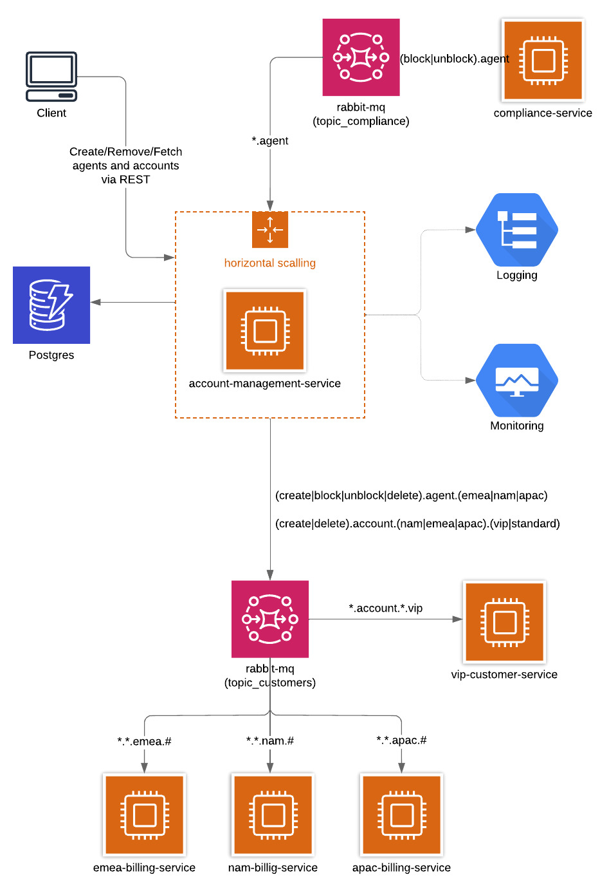

## What is this project about ?

The goal of the project was to play with the Microservice architecture and improve Python skills 

### User stories

1.  As a customer I'd like to use account-management-service REST API to create the frontend (DONE)
2. As a billing team I'd like to be updated regarding both Accounts and Agents, so I can calculate invoices (DONE)
3. As a compliance office I'd like to be able to block Agent if agent account is hacked, so agent won't be charged to the extra usage (TO DO)
4. As a Success Manager I'd like to be informed about creating and removing VIP accounts, so I can calculate key customer turnover (TO DO)

### Architecture

#### Target Diagram

https://lucid.app/lucidchart/388b7cea-029a-46ae-95e5-0c50148fb8cb/edit?viewport_loc=-176%2C-119%2C3072%2C1551%2CCFRzE~qEaxOQ&invitationId=inv_700a331f-39a6-41a5-a14a-7c5007f38322

#### Data model
</img>
- Agent e-mail is unique among all Agents from all Accounts
- Account e-mail is unique among all others Accounts 

### What is used here?
- FastAPI
  - pagination for REST requests 
- Postgres
  - asyncio
  - alembic 
- pydantic and types
- decorators
- event handling implemented by RabbitMQ used in an async way
  - under `consumer` you might find async consumer
- Docker to make a smart environment: 
  - you can have your own e2e environment locally, 
  - or run the project with PyCharm with `main.py`, 
  - or deploy container into Heroku or ECS
- telemetry
   - Papertrail  
   - Scout  
   - Liberato  

### TODO list
- play more with Heroku
  - check what resilience can be supported by Heroku
  - check if vertical/horizontal scaling can be supported by Heroku
  - Redis ?
- deploy this to Amazon ECS
- pagination for DB synchronized with FastAPI pagination but leaving abstraction layer for the DB (to be deployed as Open Source)

### How to run it
- to have all the environment in one place `docker-compose up`
  - to keep environment more robust I don't want to control the order of the images in docker-compose. Therefore, you need to run alembic 
migrations by logging into `backend` docker image and running `migrate_db.sh`
  - API address when running Docker: http://localhost:9090/_swagger
- for pytest please run `pytest`
- for Heroku please follow https://devcenter.heroku.com/articles/container-registry-and-runtime:
  - heroku login
  - heroku container:login
  - heroku create
  - define ENV variables in Heroku
       - create `AUTH_TOKEN` with token details needed to communicate with RESTAPI
       - create `TWO_FA` with token needed to erase the DB
       - if you want to see debug logs set `DEBUG_LOGGER_LEVEL` into  `True`
       - if you want FastAPI to be verbose when sending response with code 500 set `DEBUG_REST` into `True`
  - install extensions in Heroku
    - (mandatory) postgres
       - create `ASYNC_DB_URL` in heroku EVN variables
    - (optional) rabbitMQ
       - set `ENABLE_EVENTS : True` in heroku EVN variable and create `CLOUDAMQP_URL` in heroku EVN variables 
    - (optional) Scout
  - heroku container:push web
  - heroku container:release web
  
  
### Have fun ;)