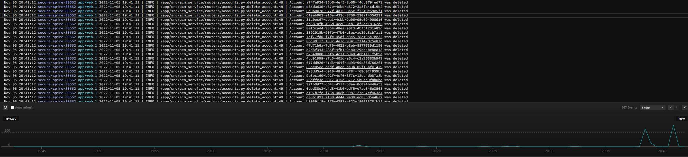
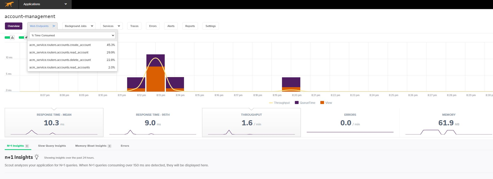
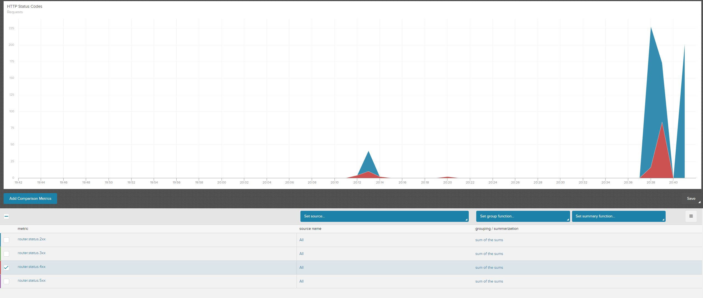

## What is this project about ?

The goal of the project was to play with the Microservice architecture and improve Python skills 

## What is used here?
- FastAPI
- database with asyncio
- pydantic and types
- decorators
- RabbitMQ used in an async way
  - under `consumer` you might find async consumer
- Docker, how to make a smart environment: 
  - so you can have your own e2e environment locally, 
  - or run the project with PyCharm with `main.py`, 
  - or deploy container into Heroku
- telemetry
   - Papertrail  
   - Scout  
   - Liberato  

## What is still on the TODO list?
- introduce alembic
- introduce caching
- play more with Heroku
  - extends telemetry with something like the Grafana dashboards (let's see what Heroku has)
  - check what resilience can be supported by Heroku
  - check if vertical/horizontal scaling can be supported by Heroku 
- add more consumers to the service and play with RabbitMQ topics
- deploy this to Amazon ECS
- CORS

## How to run it
- to have all the environment in one place `docker-compose up`
  - because I don't want to control the order of the images in docker-compose, you might need to run alembic migrations by logging into `backend` image and running `upgrade_db.sh`
- for pytest please run `pytest`
- for Heroku please follow https://devcenter.heroku.com/articles/container-registry-and-runtime:
  - heroku login
  - heroku container:login
  - heroku create
  - install extensions in Heroku
    - (mandatory) postgres
       - create `ASYNC_DB_URL` in heroku EVN variables 
    - (optional) rabbitMQ
       - set `ENABLE_EVENTS : True` in heroku EVN variable and create `CLOUDAMQP_URL` in heroku EVN variables 
    - (optional) Scout
    - (optional) if you want to see debug logs set `DEBUG_LOGGER_LEVEL: True` in heroku EVN variables
  - heroku container:push web
  - heroku container:release web
  - heroku open
  
## Have fun ;)