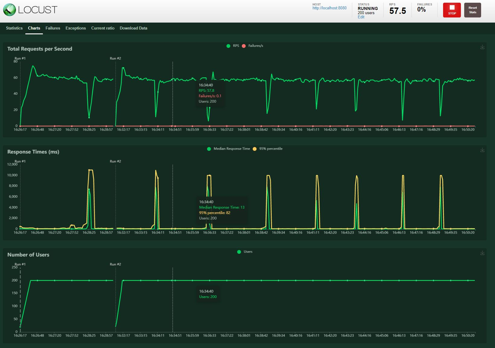

## What is this project about ?

The goal of the project was to play with the Microservice architecture and improve Python skills 

### User stories

1. As a customer I'd like to use account-management-service REST API to create the frontend (DONE)
2. As a billing team I'd like to be updated regarding both Accounts and Agents, so I can calculate invoices (DONE)
3. As a compliance office I'd like to be able to block Agent if agent account is hacked, so agent won't be charged to the extra usage (DONE)
4. As a Success Manager I'd like to be informed about creating and removing VIP accounts, so I can calculate key customer turnover (DONE)

### Architecture

### What is used here?
- FastAPI
  - 
  - pagination for REST requests
- Postgres
  - asyncio
  - alembic
- pydantic
- types
- decorators
- tests realized with pytest
  - fixtures
  - mocks
  - load tests with Locust, traffic model:
    - 30.0% get_agent
    - 20.0% generate_company_report
    - 15.0% get_account
    - 10.0% create_agent
    - 10.0% get_agents
    - 5.0% unblock_agent
    - 5.0% block_agent
    - 5.0% create_account
- event handling implemented by RabbitMQ used in an async way using Topics
  - under `demo_environment/billing_service` you get consumer for accounts/agents Topics (user story 2.)
  - under `demo_environment/compliance_service` you get producer for blocking agents (user story 3.)
  - under `demo_environment/vip_customer_service` you get consumer for VIP accounts (user story 4.)
- telemetry
   - Papertrail
   - Scout
   - Liberato

### WIP LIST
- find out the bottleneck causing drop in Locust reports
  -  
  - issue is related to too many connections to DB. Connection pooling is not helping. Cache needed
  - Working on Redis

### TODO list
- extend load tests to inject events
- play more with Heroku
  - check what resilience can be supported by Heroku
  - check if scaling can be supported by Heroku
- deploy this to Amazon ECS
- when using FastAPI pagination it would be great to make also pagination for DB requests. Open source project is not supporting this out of the box.

### How to run it
- to have all the environment in one place `docker-compose -f docker-compose-demo.yml up`
- to run DB migrations execute CLI on `backend` docker image by running `migrate_db.sh`
- REST is exposed by Swagger in http://localhost:9090/_swagger
- feel free to run this also with `main.py` after creating your venv

### How to test it
- for unit tests: 
  - `pytest src/unit_tests`
- for integration tests: 
  - `docker-compose -f docker-compose-integration.yml up`
  - run DB migrations execute CLI on `backend` docker image by running `migrate_db.sh`
  - `pytest src/integration_tests/test_flows.py`
- for load tests:
  - same as for integration tests
  - `cd src && locust -f .\integration_tests\test_load.py`

### How to deploy it
- for Heroku please follow https://devcenter.heroku.com/articles/container-registry-and-runtime:
  - heroku login
  - heroku container:login
  - heroku create
  - heroku container:push web
  - install extensions in Heroku
    - (mandatory) Postgres
    - (optional) Rabbit MQ
    - (optional) Scout
  - define ENV variables in Heroku (example values are in `backend` under `docker-compose-demo.yml` )
     - `AUTH_TOKEN` -> token needed to communicate with RESTAPI 
     - `TWO_FA`-> with token needed to erase the database 
     - `ENABLE_EVENTS` -> would you like to make use of events 
       - `CLOUDAMQP_URL` -> RabbitMQ event broker URL
       - `CLOUDAMQP_RETRIES` -> retries for the communication with event broker 
       - `CLOUDAMQP_TIMEOUT` -> timeout for the communication with the event broker
     - `ASYNC_DB_URL` -> link to async Postgres DB
     - `DEBUG_LOGGER_LEVEL` -> do you want to have debug logs ?
     - `DEBUG_REST` -> in case of response 500 do you want to have extra logs ?
  - heroku container:release web
  - open https://{your_heroku_app}/_swagger and play using `AUTH_TOKEN`
  
### Have fun ;)
